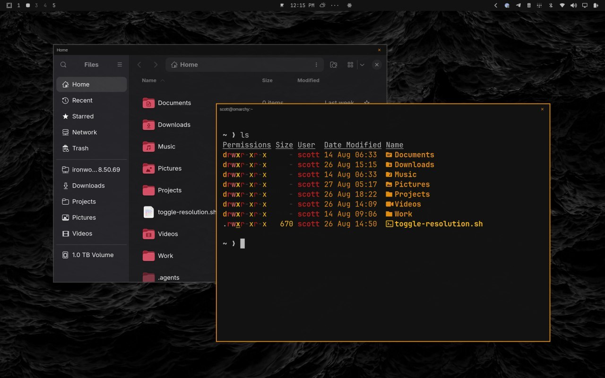
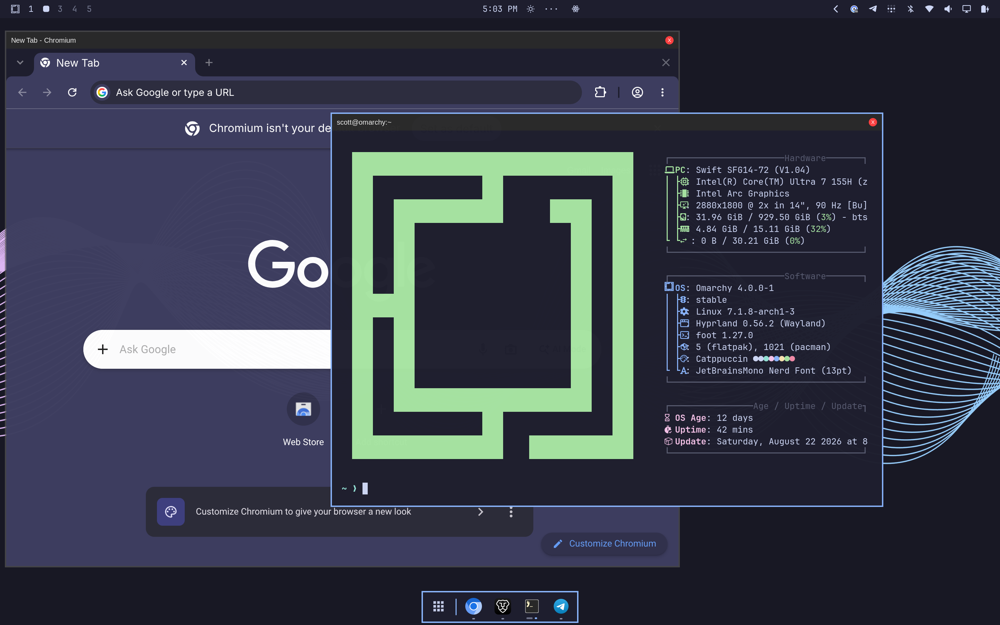

# Omarchy Classic Windows



Give Omarchy floating windows the familiar behavior people expect from Windows and macOS—without turning Omarchy into a traditional stacking desktop.

- Press **Super+T** to switch the active window between tiled and floating.
- Floating windows are centered at a comfortable size.
- Drag any edge or corner to resize.
- Click the red **X** to close.
- Tiled windows keep Omarchy's clean border-only look.



Classic Windows only adds title bars and floating-window behavior. The example above also has [Dock](https://omarchyplugins.com/plugin.html?id=rosakodu.dock) (`rosakodu.dock`) enabled along the bottom. Install that plugin separately if you want a dock.

## Before you install

This project is for **Omarchy Quattro** using Hyprland 0.56 or newer. It does not support Omarchy 3, GNOME, KDE Plasma, or other Linux desktops.

The installer:

- uses the official Hyprland `hyprbars` plugin;
- adds one file at `~/.config/hypr/classic-windows.lua`;
- adds clearly marked lines to your existing Omarchy configuration;
- backs up an existing file with the same name;
- does **not** use `sudo` or change system files.

## Install

Open a terminal, then copy and paste these commands **one line at a time**:

```bash
git clone https://github.com/jcarcinogen/omarchy-classic-windows.git ~/omarchy-classic-windows
cd ~/omarchy-classic-windows
./setup.sh
```

The setup program explains what it will change and asks before continuing. Building the official hyprbars plugin can take a few minutes the first time.

When setup finishes, **log out of Omarchy and sign in again once**. This starts a clean session with hyprbars loaded from the beginning. Then test it:

1. Open a terminal.
2. Press **Super+T**.
3. The terminal should become a centered floating window with a title bar.
4. Drag an edge or corner to resize it.
5. Click the red **X** to close it.

## Everyday controls

| What you want to do | Control |
|---|---|
| Make a tiled window float | **Super+T** |
| Put a floating window back into the layout | **Super+T** |
| Move a floating window | Drag its title bar |
| Resize a floating window | Drag any edge or corner |
| Close a floating window | Click the red **X** |

On most keyboards, **Super** is the key with the Windows logo. Apple keyboards usually label it **Command (⌘)**.

## Update

Open a terminal and run:

```bash
cd ~/omarchy-classic-windows
git pull --ff-only
./setup.sh
```

Running setup again is safe. It updates this project's file without duplicating configuration lines.

## Remove

Open a terminal and run:

```bash
cd ~/omarchy-classic-windows
./uninstall.sh
```

The remover restores the configuration that existed before installation. It leaves the shared Hyprland plugin collection installed because another plugin may use it.

After removal, you may delete the downloaded project folder:

```bash
rm -rf ~/omarchy-classic-windows
```

## Why this uses a setup script

Omarchy's shell plugins are QML components for the bar, panels, menus, overlays, and services. They cannot draw title bars on other applications or install a Hyprland C++ plugin.

Classic Windows therefore uses the correct compositor-level extension point: a small Hyprland Lua overlay plus the official hyprbars plugin. The setup script makes those changes visible, reversible, and safe for people who are new to Linux.

## Troubleshooting

See [Troubleshooting](docs/TROUBLESHOOTING.md) for plain-language fixes and diagnostic commands.

## Compatibility and scope

- Tested on Omarchy Quattro, Hyprland 0.56.2.
- Designed for the default **Super+T** floating-window shortcut.
- Uses monitor-relative sizing, so it is not tied to one laptop or resolution.
- Client-side decorations in apps such as Brave or file managers may still display their own header controls inside the app.

## License

[MIT](LICENSE) © 2026 Scott Angel
